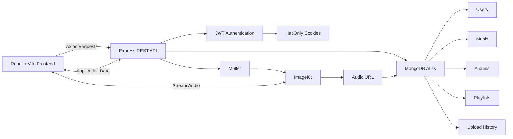
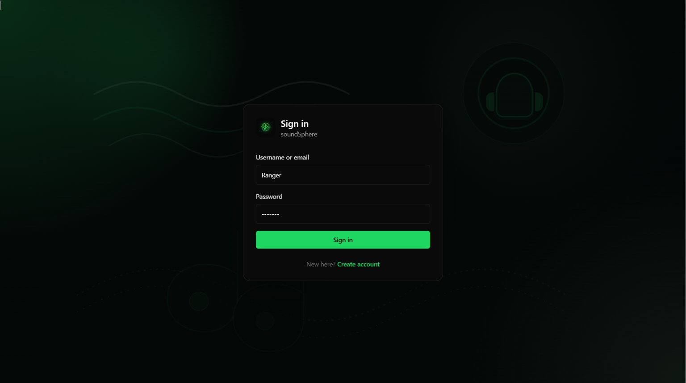
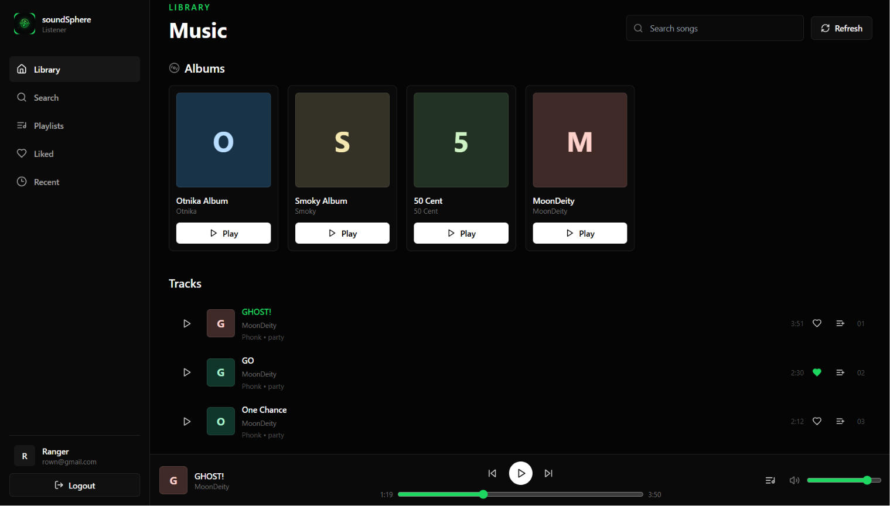
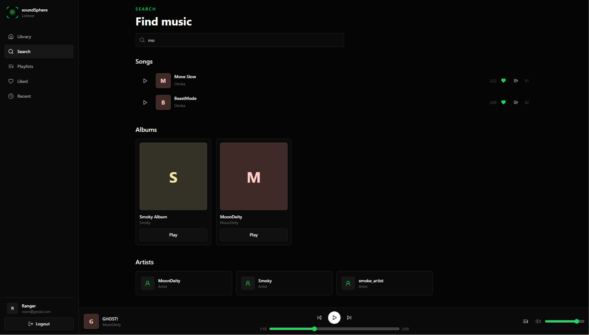
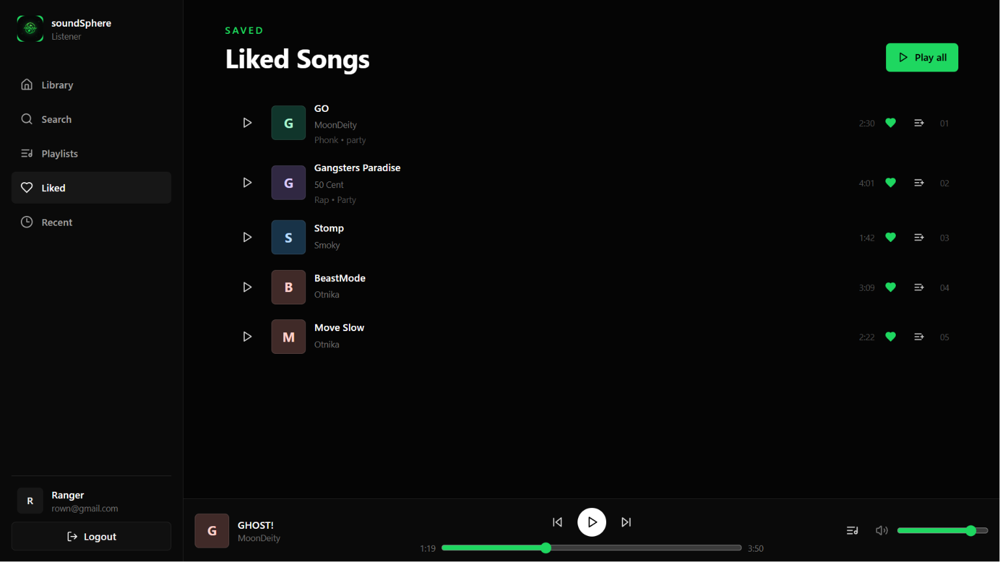
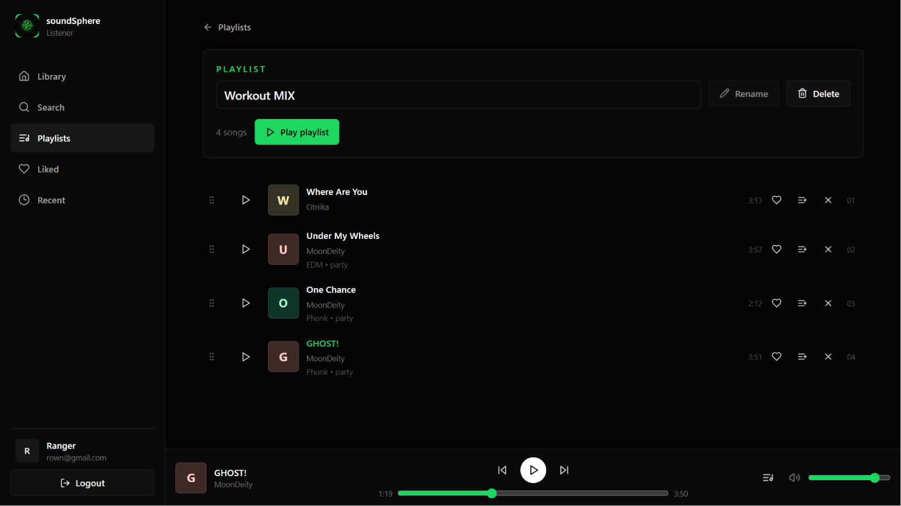
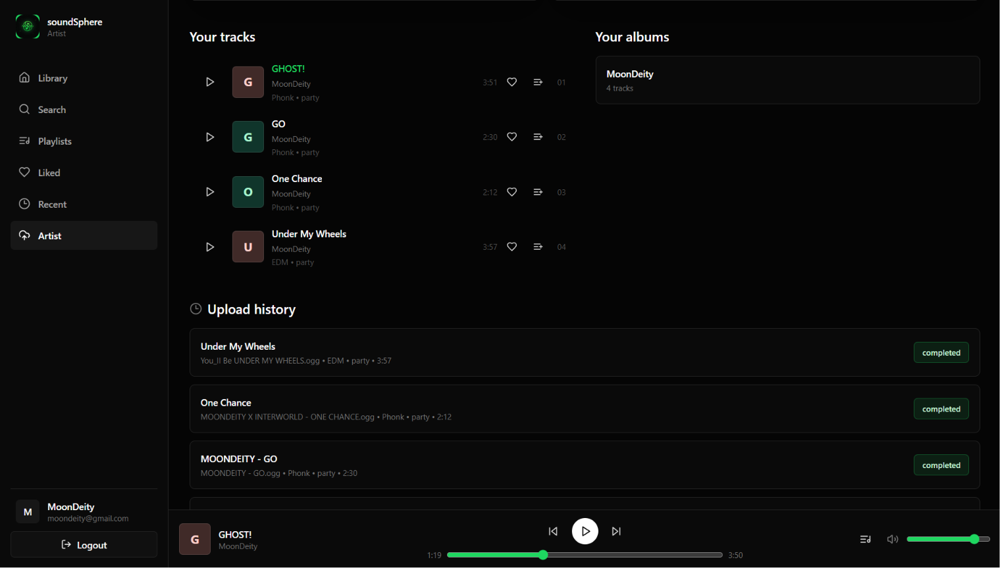
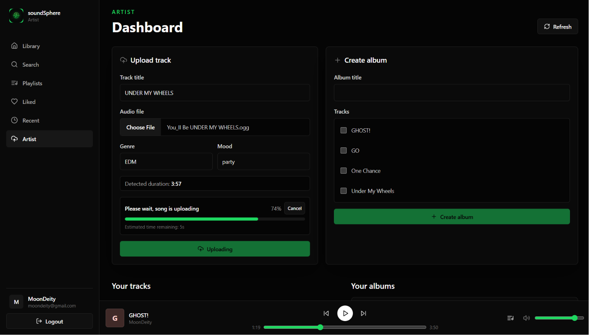
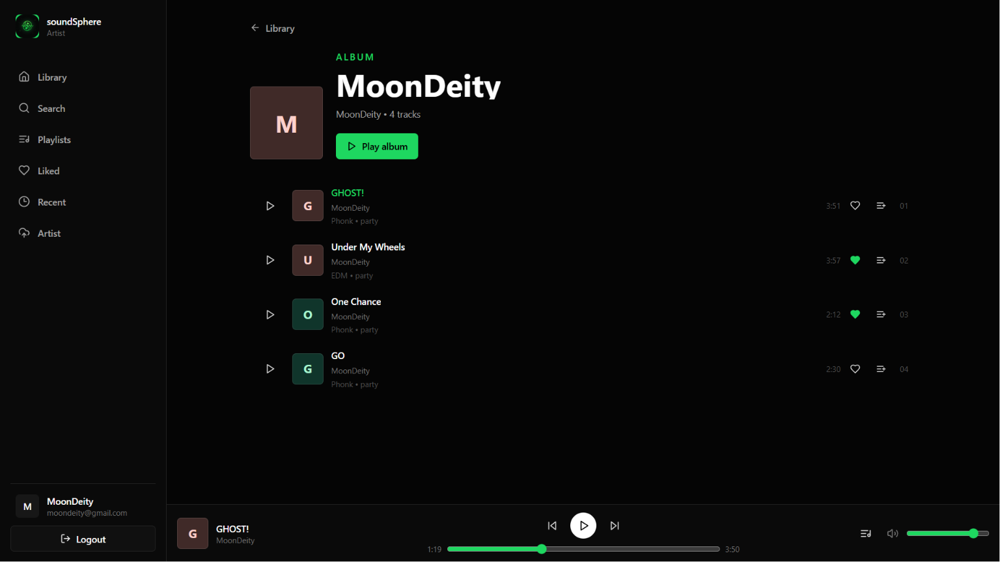

<p align="center">
  
</p>

<h1 align="center">SoundSphere</h1>

<p align="center">
A MERN-based music streaming application with dedicated artist and listener experiences.
</p>

<p align="center">


</p>

<p align="center">
  <a href="https://soundsphere-orpin.vercel.app/">Live Demo</a>
  •
  <a href="https://soundsphere-jd73.onrender.com">Backend API</a>
  •
  <a href="https://github.com/CHECHI10/soundsphere">Source Code</a>
</p>

---

## Overview

> **SoundSphere** is a full-stack music streaming platform built using the MERN stack that enables artists to upload and manage their music while allowing listeners to stream songs, build playlists, and maintain a personalized music library. The application features secure JWT authentication using HttpOnly cookies, cloud-based audio storage with ImageKit, and a responsive interface inspired by modern music streaming platforms.


## Highlights

- Full-stack MERN architecture
- JWT authentication using HttpOnly cookies
- Role-based access for Artists and Listeners
- Cloud-based audio uploads with ImageKit
- Music streaming across desktop and mobile
- Persistent audio player across page navigation
- Production deployment using Vercel and Render

## Features

### Authentication

- Secure user registration and login
- JWT-based authentication using HttpOnly cookies
- Role-based access control for **Users** and **Artists**
- Protected routes for authenticated users
- Persistent login sessions

---

### Music Streaming

- Stream uploaded music directly from cloud storage
- Play, pause, seek, and control volume
- Automatic playback of the next song in the queue
- Persistent music player across page navigation
- Recently played songs
- Queue-based playback experience

---

### Music Library

- Like and unlike songs
- Create personal playlists
- Add songs to playlists
- Browse and manage a personal music library

---

### Search

- Search songs by title
- Search artists
- Fast server-side search experience

---

### Artist Dashboard

- Dedicated artist accounts
- Upload songs to the platform
- Create albums
- View upload history
- Manage published music

---

### Cloud & Deployment

- Audio files stored using ImageKit
- MongoDB Atlas for persistent storage
- Backend deployed on Render
- Frontend deployed on Vercel
- Responsive interface for desktop and mobile devices

---

## Demo Content

The application currently includes:

- 4 Artist accounts
- 15 Demo songs
- Albums created by different artists

The dataset is intentionally kept small to demonstrate application functionality while keeping the repository lightweight.

## Tech Stack

| Category | Technologies |
|----------|--------------|
| Frontend | React, Vite, Tailwind CSS, React Router, Axios, Context API, React Icons |
| Backend | Node.js, Express.js, Mongoose, Express Validator, Multer, Bcrypt, Cookie Parser, CORS |
| Database | MongoDB Atlas |
| Authentication | JSON Web Tokens (JWT), HttpOnly Cookies |
| Cloud Storage | ImageKit |
| Deployment | Vercel (Frontend), Render (Backend) |
| Development Tools | Git, GitHub, Postman |

## Architecture

The application follows a client-server architecture where the frontend communicates with a RESTful Express API. Authentication is handled using JWT tokens stored in HttpOnly cookies. Audio files are uploaded to ImageKit, while metadata such as users, playlists, albums, and song information is stored in MongoDB Atlas.

### Request Flow

1. The React frontend sends API requests using Axios.
2. Express processes the request and performs authentication and validation.
3. Audio files are uploaded to ImageKit.
4. Metadata is stored in MongoDB Atlas.
5. The API returns the required data to the frontend.
6. Songs are streamed directly from ImageKit using the stored URLs.

## Architecture

SoundSphere follows a client-server architecture where the React frontend communicates with a RESTful Express API. Authentication is handled using JWT tokens stored in HttpOnly cookies, audio files are uploaded to ImageKit, and application metadata is stored in MongoDB Atlas.



### Upload Flow

```text
Artist
    │
Select Audio File
    │
multipart/form-data
    │
Multer
    │
Buffer
    │
ImageKit
    │
Returns Audio URL
    │
MongoDB stores metadata + ImageKit URL
    │
Frontend streams directly from ImageKit
```

### Authentication Flow

```text
Login
   │
JWT Generated
   │
HttpOnly Cookie
   │
Browser stores Cookie
   │
Axios (withCredentials)
   │
Express Middleware
   │
Protected Routes
```

## Screenshots

<table>
<tr>
<td align="center">
<br>
<b>Login</b>
</td>
<td align="center">
<br>
<b>Home</b>
</td>
</tr>

<tr>
<td align="center">
<br>
<b>Search</b>
</td>
<td align="center">
<br>
<b>Liked Songs</b>
</td>
</tr>

<tr>
<td align="center">
<br>
<b>Playlist</b>
</td>
<td align="center">
<br>
<b>Artist Dashboard</b>
</td>
</tr>

<tr>
<td align="center">
<br>
<b>Upload Music</b>
</td>
<td align="center">
<br>
<b>Album</b>
</td>
</tr>
</table>


## Project Structure

```text
SoundSphere
│
├── frontend
│   ├── public
│   ├── src
│   │   ├── api
│   │   ├── components
│   │   ├── context
│   │   ├── pages
│   │   ├── utils
│   │   ├── App.jsx
│   │   └── main.jsx
│   ├── package.json
│   └── vite.config.js
│
├── backend
│   ├── src
│   │   ├── controllers
│   │   ├── db
│   │   ├── middlewares
│   │   ├── models
│   │   ├── routes
│   │   ├── services
│   │   ├── utils
│   │   └── app.js
│   ├── package.json
│   └── server.js
│
├── assets
├── screenshots
└── README.md
```

### Directory Responsibilities

| Directory | Responsibility |
|------------|----------------|
| `frontend/src/api` | Axios API layer for backend communication |
| `frontend/src/components` | Reusable UI components |
| `frontend/src/context` | Global application state and authentication |
| `frontend/src/pages` | Route-level pages |
| `frontend/src/utils` | Shared utility functions |
| `backend/src/controllers` | Business logic for API endpoints |
| `backend/src/db` | MongoDB connection configuration |
| `backend/src/middlewares` | Authentication, validation, and request middleware |
| `backend/src/models` | Mongoose schemas and models |
| `backend/src/routes` | REST API route definitions |
| `backend/src/services` | External service integrations (ImageKit, etc.) |
| `backend/src/utils` | Shared backend helper functions |


## Installation

### Clone the repository

```bash
git clone https://github.com/CHECHI10/soundsphere.git
cd soundsphere
```

---

### Backend Setup

```bash
cd backend
npm install
npm run dev
```

The backend server will start on the configured port (default: `5000`).

---

### Frontend Setup

Open a new terminal.

```bash
cd frontend
npm install
npm run dev
```

The frontend will start on the configured Vite development server.

---

### Running the Application

Start both services in separate terminals:

| Service | Command |
|---------|---------|
| Backend | `cd backend && npm run dev` |
| Frontend | `cd frontend && npm run dev` |

Once both services are running, open the frontend in your browser to access SoundSphere.

## Environment Variables

Create a `.env` file inside the `backend` directory.

### Backend (`backend/.env`)

```env
PORT=5000

MONGO_URI=<your_mongodb_connection_string>

JWT_SECRET=<your_jwt_secret>

CLIENT_ORIGIN=http://localhost:5173

IMAGEKIT_PRIVATE_KEY=<your_private_key>

IMAGEKIT_PUBLIC_KEY=<your_public_key>

IMAGEKIT_URL_ENDPOINT=https://ik.imagekit.io/your_imagekit_id
```

---

Create a `.env` file inside the `frontend` directory.

### Frontend (`frontend/.env`)

```env
VITE_API_URL=http://localhost:5000/api
```

> For production deployments, update `CLIENT_ORIGIN` and `VITE_API_URL` to match your deployed frontend and backend URLs.

## API Overview

The backend exposes a RESTful API organized into dedicated modules for authentication, music management, playlists, library operations, search, and artist functionality.

### Authentication

| Method | Endpoint | Description |
|--------|----------|-------------|
| POST | `/api/auth/register` | Register a new user |
| POST | `/api/auth/login` | Authenticate user |
| POST | `/api/auth/logout` | Logout current user |
| GET | `/api/auth/me` | Retrieve authenticated user |

---

### Music

| Method | Endpoint | Description |
|--------|----------|-------------|
| GET | `/api/music` | Retrieve all songs |
| POST | `/api/music/upload` | Upload a new song *(Artist)* |
| GET | `/api/music/albums` | Retrieve albums |
| GET | `/api/music/uploads/mine` | Retrieve artist uploads |

---

### Playlists

| Method | Endpoint | Description |
|--------|----------|-------------|
| GET | `/api/playlists` | Retrieve user playlists |
| POST | `/api/playlists` | Create a playlist |
| PUT | `/api/playlists/:id` | Update playlist |
| DELETE | `/api/playlists/:id` | Delete playlist |

---

### Library

| Method | Endpoint | Description |
|--------|----------|-------------|
| GET | `/api/library/likes` | Retrieve liked songs |
| POST | `/api/library/likes` | Like or unlike a song |

---

### Search

| Method | Endpoint | Description |
|--------|----------|-------------|
| GET | `/api/search` | Search songs and artists |

---

### Artists

| Method | Endpoint | Description |
|--------|----------|-------------|
| GET | `/api/artists` | Retrieve artist information |
| GET | `/api/artists/:id` | Retrieve artist profile |

## Challenges Faced

Developing SoundSphere involved solving several real-world engineering challenges beyond implementing application features.

### Cross-Origin Authentication

Implementing secure authentication across Vercel (Frontend) and Render (Backend) required configuring CORS correctly while using JWT tokens stored in HttpOnly cookies. This ensured secure session management without exposing authentication tokens to client-side JavaScript.

---

### Cloud-Based Audio Storage

Instead of storing uploaded audio locally, the application integrates with ImageKit to upload music files and stream them efficiently. MongoDB stores only the metadata and cloud URLs, keeping the backend lightweight and scalable.

---

### File Upload Pipeline

Handling audio uploads required processing multipart form data using Multer, converting uploaded files into buffers, uploading them to ImageKit, and storing the returned URLs for streaming.

---

### Role-Based Access Control

The application provides separate experiences for listeners and artists. Middleware-based authorization ensures that only artist accounts can upload songs or create albums while keeping listener functionality isolated.

---

### Production Deployment

Deploying the application required configuring environment variables, secure cookies, cloud storage credentials, and communication between independently deployed frontend and backend services.


## Key Learnings

Building SoundSphere provided practical experience in designing, developing, deploying, and maintaining a full-stack web application.

Throughout the project I gained experience with:

- Designing RESTful APIs using Express.js
- Building reusable React components and managing application state
- Implementing JWT authentication with HttpOnly cookies
- Managing role-based authorization using middleware
- Uploading and streaming media using ImageKit
- Designing MongoDB schemas and relationships with Mongoose
- Deploying production applications using Render and Vercel
- Configuring CORS and secure cross-origin communication
- Structuring a scalable MERN application using modular architecture
- Debugging production deployment and cloud integration issues

## Future Improvements

Planned improvements for future versions of SoundSphere include:

- Queue management interface
- Shuffle and repeat playback modes
- Song and album cover image uploads
- Artist profile customization
- Music recommendations based on listening history
- Lyrics integration
- Recently searched history
- Playlist collaboration
- Notifications for newly uploaded music
- Progressive Web App (PWA) support

## License

This project is licensed under the MIT License. See the `LICENSE` file for more information.

## Contact

**Developer:** Rohit Choudhary

GitHub: https://github.com/CHECHI10

LinkedIn: https://www.linkedin.com/in/rohit-choudhary01

Email: <rohitchechi10@gmail.com>